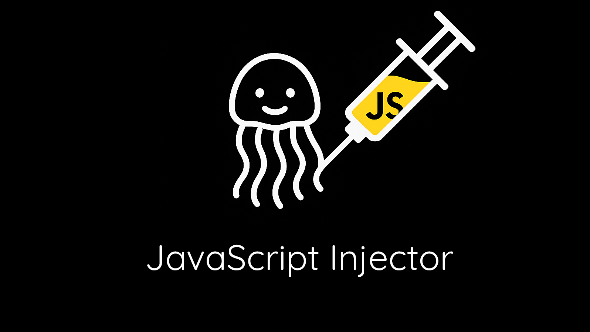

# Jellyfin Plugin - JavaScript Injector

The JavaScript Injector plugin for Jellyfin allows you to inject multiple, independent JavaScript snippets into the Jellyfin web UI. It provides a powerful and easy-to-use configuration page to manage all your custom scripts from one place.

<p align="center">
  
  
  
  <br>  <br>
  
  
  <br>  <br>
  <a href="https://discord.com/channels/1381737066366242896/1442128048873930762"></a>
  <br/><br/>
    
<br>
</p>

## ✨ Features

-   **Multiple Scripts**: Add as many custom JavaScript snippets as you want.

-   **Organized UI**: Each script is managed in its own collapsible section, keeping your configuration clean and easy to navigate.

-   **Enable/Disable on the Fly**: Toggle individual scripts on or off without having to delete the code.

-   **Immediate Injection**: The plugin injects a loader script into the Jellyfin web UI on every page load, with no changes to your Jellyfin install on disk. Your custom scripts are loaded dynamically, and changes take effect after a simple browser refresh.

-   **Plugin Support**: Other plugins can register their own JavaScript snippets programmatically using the provided service interface.

## ⚙️ Installation


1.  In Jellyfin, go to **Dashboard** > **Plugins** > **Catalog** > ⚙️
2.  Click **➕** and give the repository a name (e.g., "JavaScript Injector Repo").
3.  Set the **Repository URL** to:

> [!IMPORTANT]
> **If you are on Jellyfin version 10.11**
> ``` 
> https://raw.githubusercontent.com/n00bcodr/jellyfin-plugins/main/10.11/manifest.json 
> ```
> If you are on Jellyfin version 12
> ``` 
> https://raw.githubusercontent.com/n00bcodr/jellyfin-plugins/main/12/manifest.json 
> ```

4.  Click **Save**.
5.  Go to the **Catalog** tab, find **JavaScript Injector** in the list, and click **Install**.
6.  **Restart** your Jellyfin server to complete the installation.

---


## 🔧 Configuration

1.  After installing, navigate to **Dashboard** > **Plugins** > **JavaScript Injector** in the list **--OR--** click on "JS Injector" in the dashboard sidebar

2.  Click **Add Script** to create a new entry.
3.  Give your script a descriptive **name**.
4.  Enter your code in the **JavaScript Code** text area.
5.  Use the **Enabled** checkbox to control whether the script is active.
6.  Click **Save**.
7.  **Refresh your browser** to see the changes take effect.


## ⌨️ Usage Examples

### Example 1: Simple Browser Alert Message

A great way to test if the plugin is working.

```js
(function() {
    'use strict';

    const toast= `
        alert('Yay!, Javascript injection worked!');
    `;

    const scriptElem = document.createElement('script');
    scriptElem.textContent = toast;
    document.head.appendChild(scriptElem);
})();


```

### Example 2: Add a Custom Banner

This script adds a banner to the top of the page for a specific user.

```js
// Change this to the username you want to target
(function () {
    const targetUsername = 'admin';

    const flashingBannerCSS = `
    @keyframes flashBanner {
        0% { background-color: #ffeb3b; color: black; }
        50% { background-color: #ff2111; color: white; }
        100% { background-color: #ffeb3b; color: black; }
    }
    .skinHeader::before {
        content: "⚠️ NOTICE: Special Banner for ${targetUsername} ⚠️";
        display: block;
        width: 100%;
        text-align: center;
        font-weight: bold;
        font-size: 1.2rem;
        padding: 0px;
        animation: flashBanner 1s infinite;
        position: relative;
        z-index: 9999;
    }
    `;

    function tryInjectBanner() {
        const userButton = document.querySelector(".headerUserButton");
        if (userButton && userButton.title.toLowerCase() === targetUsername.toLowerCase()) {
            const styleElem = document.createElement('style');
            styleElem.innerText = flashingBannerCSS;
            document.head.appendChild(styleElem);
            return true;
        }
        return false;
    }
    const interval = setInterval(() => {
        if (tryInjectBanner()) clearInterval(interval);
    }, 300);
})();

```

## 🔌 Plugin Interface

Other Jellyfin plugins can programmatically register JavaScript snippets using the `IJavaScriptRegistrationService` interface. Here's an example of how to use it:

```csharp
using System.Reflection;
using System.Runtime.Loader;
using Newtonsoft.Json.Linq;

public class YourPlugin : BasePlugin
{
    public void RegisterYourScript()
    {
        try
        {
            // Find the JavaScript Injector assembly
            Assembly? jsInjectorAssembly = AssemblyLoadContext.All
                .SelectMany(x => x.Assemblies)
                .FirstOrDefault(x => x.FullName?.Contains("Jellyfin.Plugin.JavaScriptInjector") ?? false);

            if (jsInjectorAssembly != null)
            {
                // Get the PluginInterface type
                Type? pluginInterfaceType = jsInjectorAssembly.GetType("Jellyfin.Plugin.JavaScriptInjector.PluginInterface");

                if (pluginInterfaceType != null)
                {
                    // Create the registration payload
                    var scriptRegistration = new JObject
                    {
                        { "id", $"{Id}-my-script" }, // Unique ID for your script
                        { "name", "My Custom Script" },
                        { "script", @"
                            // Your JavaScript code here
                            console.log('Hello from my plugin!');
                        " },
                        { "enabled", true },
                        { "requiresAuthentication", false }, // Set to true if script should only run for logged-in users
                        { "pluginId", Id.ToString() },
                        { "pluginName", Name },
                        { "pluginVersion", Version.ToString() }
                    };

                    // Register the script
                    var registerResult = pluginInterfaceType.GetMethod("RegisterScript")?.Invoke(null, new object[] { scriptRegistration });

                    if (registerResult is bool success && success)
                    {
                        _logger.LogInformation("Successfully registered JavaScript with JavaScript Injector plugin.");
                    }
                    else
                    {
                        _logger.LogWarning("Failed to register JavaScript with JavaScript Injector plugin. RegisterScript returned false.");
                    }
                }
            }
        }
        catch (Exception ex)
        {
            _logger?.LogError(ex, "Failed to register JavaScript with JavaScript Injector plugin.");
        }
    }

    public void UnregisterYourScripts()
    {
        try
        {
            // Find the JavaScript Injector assembly
            Assembly? jsInjectorAssembly = AssemblyLoadContext.All
                .SelectMany(x => x.Assemblies)
                .FirstOrDefault(x => x.FullName?.Contains("Jellyfin.Plugin.JavaScriptInjector") ?? false);

            if (jsInjectorAssembly != null)
            {
                Type? pluginInterfaceType = jsInjectorAssembly.GetType("Jellyfin.Plugin.JavaScriptInjector.PluginInterface");

                if (pluginInterfaceType != null)
                {
                    var unregisterResult = pluginInterfaceType.GetMethod("UnregisterAllScriptsFromPlugin")?.Invoke(null, new object[] { Id.ToString() });

                    // or if you want to unregister a specific script
                    //pluginInterfaceType.GetMethod("UnregisterScript")?.Invoke(null, new object[] { $"{Id}-my-script" }); // -> returns bool, so adjust the result handling accordingly

                    if (unregisterResult is int removedCount)
                    {
                        _logger?.LogInformation("Successfully unregistered {Count} script(s) from JavaScript Injector plugin.", removedCount);
                    }
                    else
                    {
                        _logger?.LogWarning("Failed to unregister scripts from JavaScript Injector plugin. Method returned unexpected value.");
                    }
                }
            }
        }
        catch (Exception ex)
        {
            _logger?.LogError(ex, "Failed to unregister JavaScript scripts.");
        }
    }
}
```

## 🙏🏻Credits

This plugin is a fork of and builds upon the original work of [johnpc](https://github.com/johnpc/jellyfin-plugin-custom-javascript). Thanks to the original author for creating the foundation for this project.

## 🗒️ Note

Be careful when using any custom JavaScript, as it can potentially introduce security vulnerabilities or break the Jellyfin UI. Only use code from trusted sources or code that you have written and fully understand.

---

<div align="center">

**Made with 💜 for Jellyfin and the community**

### Enjoying Jellyfin JavaScript Injector?

Checkout my other repos!

[Jellyfin-Enhanced](https://github.com/n00bcodr/Jellyfin-Enhanced) (javascript/plugin) • [Jellyfin-Elsewhere](https://github.com/n00bcodr/Jellyfin-Elsewhere) (javascript) • [Jellyfin-Tweaks](https://github.com/n00bcodr/JellyfinTweaks) (plugin) • [Jellyfin-JavaScript-Injector](https://github.com/n00bcodr/Jellyfin-JavaScript-Injector) (plugin) • [Jellyfish](https://github.com/n00bcodr/Jellyfish/) (theme)


</div>
